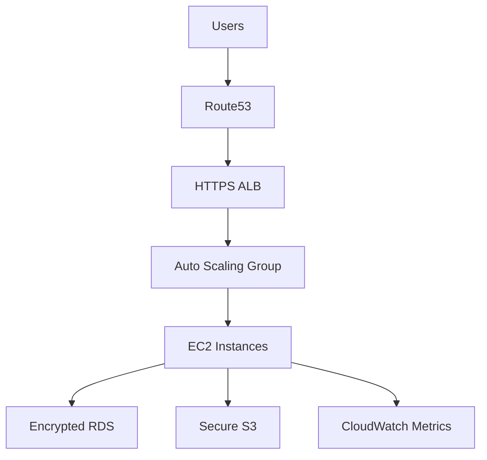

**CSY6225inc GitHub Organization**  
*Cloud-Native Application Development & Infrastructure as Code*  

---

### **Overview**  
Welcome to **CSY6225inc**! This organization hosts production-grade cloud-native systems built for scalability, security, and resilience. Each repository represents a critical component of a modern cloud architecture, developed as part of the *Network Structures and Cloud Computing* curriculum.

---

### **🚀 Quick Start**  
**1. Core Repositories**  
| Repository | Purpose |  
|------------|---------|  
| [**webapp**](https://github.com/CSY6225inc/webapp) | Node.js backend API with health checks, S3 file management, and observability |  
| [**tf-aws-infra**](https://github.com/CSY6225inc/tf-aws-infra) | Terraform modules for AWS VPC, Auto Scaling, RDS, and secure infrastructure |  

**2. Architecture Flow**  

---

### **📦 Key Repositories**  

#### **1. Web Application (`webapp`)**  
*API backend with production-ready features*  
- **Tech Stack**: Node.js, Express, PostgreSQL, AWS S3  
- **Features**:  
  - Health check endpoints (`/healthz`, `/cicd`)  
  - Secure file upload/delete with IAM roles  
  - CloudWatch logging & custom metrics  
  - 98% test coverage (Jest/Supertest)  

[➡️ Explore Webapp](https://github.com/CSY6225inc/webapp)  

#### **2. Infrastructure as Code (`tf-aws-infra`)**  
*Enterprise-grade AWS provisioning*  
- **Tech Stack**: Terraform, Packer, AWS (VPC/ALB/RDS)  
- **Features**:  
  - Multi-AZ VPC with NAT Gateway  
  - Auto Scaling Group (min:3, max:5)  
  - KMS-encrypted RDS & S3  
  - CI/CD-ready GitHub Actions  

[➡️ Explore Infrastructure](https://github.com/CSY6225inc/tf-aws-infra)  

---

### **🛠️ Technology Stack**  
  
  
  
  

---

### **🔍 Architecture Diagram**  
  
*Components: VPC, ALB, Auto Scaling, RDS, S3, CloudWatch*  

---

### **📘 Course Connection**  
Developed for **CSYE6225 - Network Structures & Cloud Computing**, these projects implement:  
✅ 12-factor app principles  
✅ Infrastructure as Code (IaC)  
✅ CI/CD pipelines  
✅ Security best practices  

---

### **🤝 Contributing**  
1. Fork the repository  
2. Create feature branch: `git checkout -b feat/your-idea`  
3. Submit PR with:  
   - Test coverage >90%  
   - Terraform validation (`fmt`/`validate`)  
   - Updated documentation  

---

### **📜 License**  
MIT License - See [LICENSE](https://github.com/CSY6225inc/.github/blob/main/LICENSE) in each repository.  

---

**Explore. Learn. Build.**  
[CSY6225inc GitHub Profile](https://github.com/CSY6225inc)